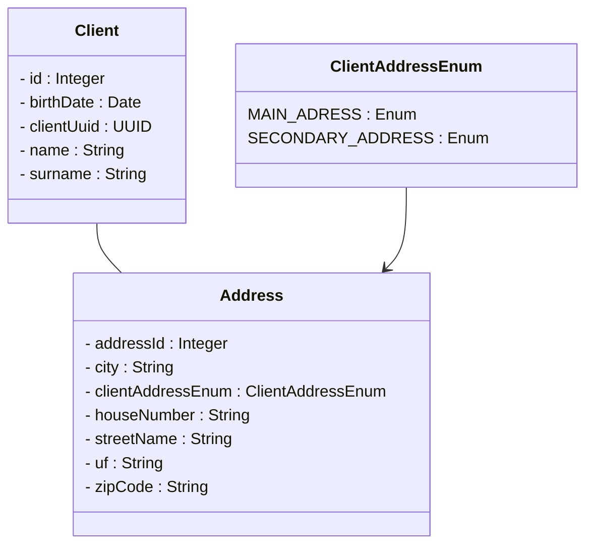

## Attus Back-End Java Developer Vacancy

### Author:
- [@gabrielguidini](https://github.com/gabrielguidini)

### - Description / Descrição:
- This project consists in a application which needs to be able to manage client and their address

