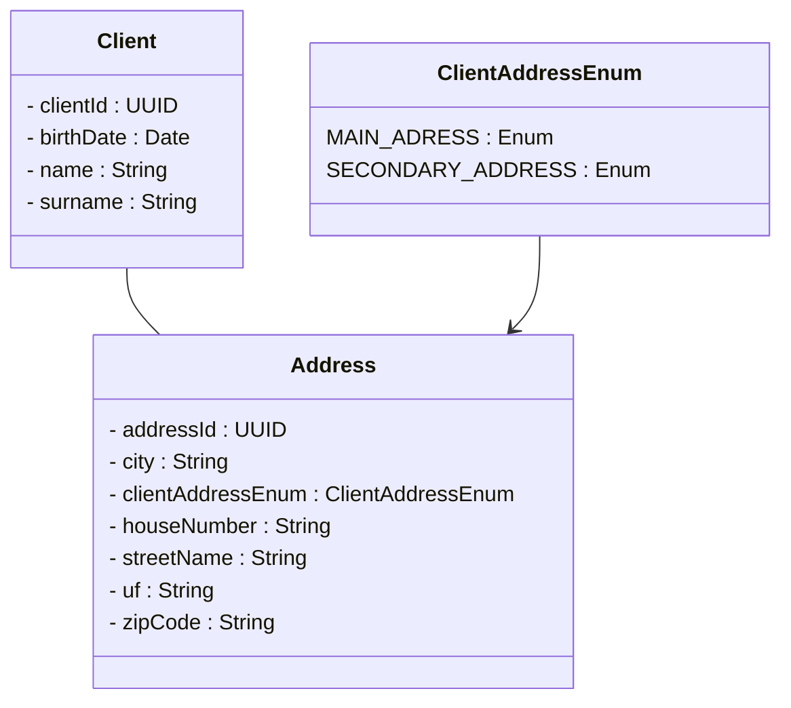

## Attus Back-End Java Developer Vacancy

### Author:
- [@gabrielguidini](https://github.com/gabrielguidini)

### - Description / Descrição:
- This is a job test that consists in creating an application that manages client and their addresses entirely
- The main goals with this api is to:
  - Make a simple CRUD one or more clients;
  - Make a simples CRUD to get one or more addresses from a client;
  - Indicate which address is the main one.
- To enter de swagger UI page:
  - http://localhost:8080/swagger-ui/index.html#/
- Mermaid UML

